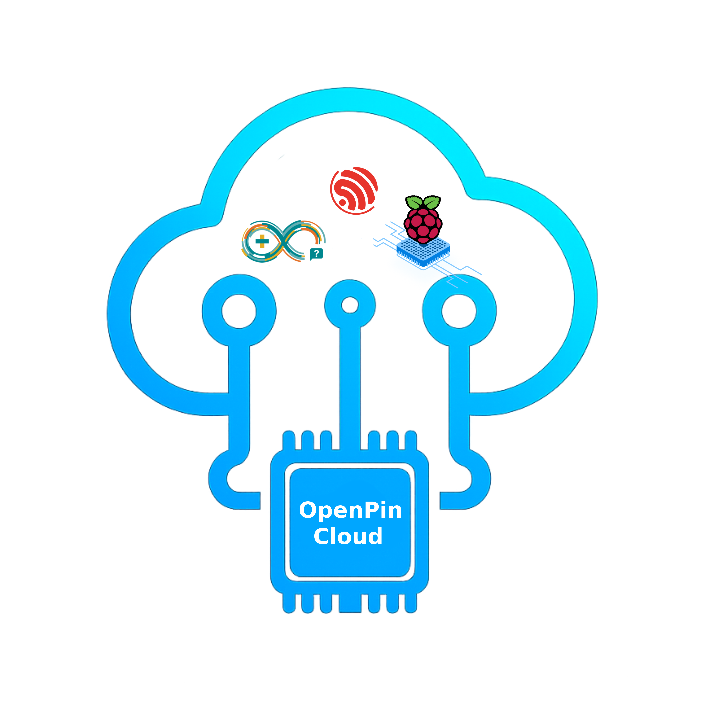
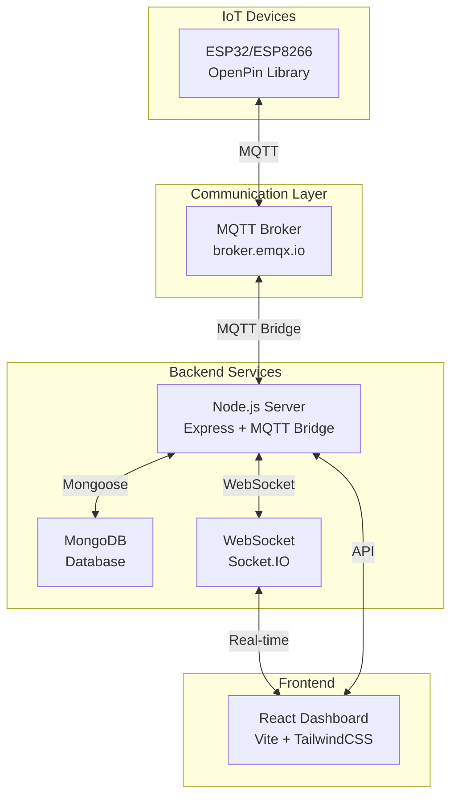

# 🌐 OpenPin Cloud IoT Platform

<div align="center">



**A Developer-Friendly IoT Cloud Platform for ESP32/ESP8266 Devices**

[](https://reactjs.org/)
[](https://nodejs.org/)
[](https://mongodb.com/)
[](https://mqtt.org/)
[](LICENSE)

[🚀 Live Demo](https://openpin-cloud.vercel.app) • [📖 Documentation](#documentation) • [🔧 Installation](#installation) • [🤝 Contributing](#contributing)

</div>

---

## 📋 Table of Contents

- [🌟 Overview](#overview)
- [✨ Features](#features)
- [🏗️ Architecture](#architecture)
- [🛠️ Technology Stack](#technology-stack)
- [🔧 Installation](#installation)
- [🚀 Quick Start](#quick-start)
- [📱 Usage](#usage)
- [📚 API Documentation](#api-documentation)
- [🔌 Arduino Library](#arduino-library)
- [🌐 Deployment](#deployment)
- [🤝 Contributing](#contributing)
- [📄 License](#license)
- [👨‍💻 Author](#author)

---

## 🌟 Overview

**OpenPin Cloud** is a comprehensive IoT platform that enables developers to seamlessly connect, monitor, and control ESP32/ESP8266 devices from anywhere in the world. Built with modern web technologies and real-time communication protocols, OpenPin provides an intuitive dashboard for managing IoT projects and devices.

### 🎯 Key Objectives

- **Simplicity**: Easy-to-use Arduino library with minimal setup
- **Real-time**: Live data monitoring and device control
- **Scalability**: Support for multiple projects and devices
- **Security**: Token-based authentication and secure communication
- **Flexibility**: Customizable virtual pins and data visualization

---

## ✨ Features

### 🖥️ **Web Dashboard**
- **Real-time Monitoring**: Live sensor data visualization with interactive charts
- **Device Control**: Send commands to devices instantly via WebSocket
- **Project Management**: Organize devices into logical projects
- **User Authentication**: Secure login/registration system
- **Responsive Design**: Works seamlessly on desktop and mobile devices

### 🔧 **Device Management**
- **Multi-Device Support**: ESP32, ESP8266, Arduino, and other microcontrollers
- **Virtual Pins**: Abstract hardware pins for flexible data handling
- **Device Status**: Real-time online/offline monitoring
- **Drag & Drop UI**: Intuitive interface for managing device layouts

### 🌐 **Communication**
- **MQTT Protocol**: Reliable device-to-cloud communication via broker.emqx.io
- **WebSocket**: Real-time browser updates using Socket.IO
- **RESTful API**: Complete REST API for integration with third-party services
- **Bidirectional Data Flow**: Send and receive data between devices and dashboard

### 🛡️ **Security & Authentication**
- **JWT Tokens**: Secure user authentication with HTTP-only cookies
- **Device Secrets**: Unique token-based device authentication
- **CORS Protection**: Configured cross-origin resource sharing
- **Input Validation**: Server-side validation for all API endpoints

---

## 🏗️ Architecture



### 📊 **Data Flow**

1. **Device → Cloud**: Sensors send data via MQTT to the broker
2. **Cloud Processing**: Server processes and stores data in MongoDB
3. **Real-time Updates**: WebSocket pushes live data to connected clients
4. **User Control**: Dashboard sends commands back to devices via MQTT

---

## 🛠️ Technology Stack

### **Frontend**
- **React 19.1** - Modern UI framework with hooks
- **Vite** - Fast build tool and development server
- **TailwindCSS** - Utility-first CSS framework
- **Zustand** - Lightweight state management
- **React Router** - Client-side routing
- **Chart.js & Recharts** - Data visualization
- **Socket.IO Client** - Real-time communication
- **React DnD** - Drag and drop functionality

### **Backend**
- **Node.js & Express** - Server runtime and web framework
- **MongoDB & Mongoose** - NoSQL database and ODM
- **Socket.IO** - WebSocket server for real-time communication
- **MQTT.js** - MQTT client for IoT device communication
- **JWT** - JSON Web Tokens for authentication
- **bcryptjs** - Password hashing

### **IoT Library**
- **Arduino C++** - Native ESP32/ESP8266 support
- **PubSubClient** - MQTT client library
- **ArduinoJson** - JSON parsing and serialization
- **WiFi** - Network connectivity

### **DevOps & Deployment**
- **Vercel** - Frontend and backend hosting
- **ESLint** - Code linting and formatting
- **Git** - Version control

---

## 🔧 Installation

### **Prerequisites**

- Node.js (v16 or higher)
- MongoDB (local or cloud instance)
- Arduino IDE (for device development)
- Git

### **Clone Repository**

```bash
git clone https://github.com/ManashR7488/OpenPin-Cloud.git
cd OpenPin-Cloud
```

### **Backend Setup**

```bash
# Navigate to server directory
cd server

# Install dependencies
npm install

# Create environment file
cp .env.example .env

# Configure environment variables
# Edit .env file with your settings:
# - MONGODB_URI
# - JWT_SECRET
# - NODE_ENV
# - MQTT_BROKER_URL

# Start development server
npm run dev
```

### **Frontend Setup**

```bash
# Navigate to client directory
cd client

# Install dependencies
npm install

# Start development server
npm run dev
```

### **Arduino Library Setup**

```bash
# Copy the OpenPin library to your Arduino libraries folder
cp -r Library/OpenPin ~/Documents/Arduino/libraries/

# Or install via Arduino IDE:
# Sketch → Include Library → Add .ZIP Library → Select Library/OpenPin.zip
```

---

## 🚀 Quick Start

### **1. Create Account & Project**

1. Visit the web dashboard and create an account
2. Create a new project (e.g., "My Smart Home")
3. Add a device (e.g., "Living Room Sensor")
4. Note the device secret token

### **2. Program Your Device**

```cpp
#include <OpenPin.h>

OpenPin device;

void setup() {
  Serial.begin(115200);
  
  // Connect to WiFi
  device.begin("YOUR_WIFI_SSID", "YOUR_WIFI_PASSWORD");
  
  // Connect to OpenPin Cloud
  if (device.connect("YOUR_DEVICE_SECRET_TOKEN")) {
    Serial.println("Connected to OpenPin Cloud!");
  }
}

void loop() {
  // Send sensor data every 10 seconds
  static unsigned long lastSend = 0;
  if (millis() - lastSend > 10000) {
    // Read temperature sensor
    float temperature = 25.5; // Replace with actual sensor reading
    device.virtualWrite("temperature", temperature);
    
    lastSend = millis();
  }
  
  // Maintain connection
  device.loop();
}
```

### **3. Monitor Data**

1. Upload the code to your ESP32/ESP8266
2. Open the web dashboard
3. Navigate to your project → device
4. Watch real-time temperature data appear!

---

## 📱 Usage

### **Dashboard Navigation**

- **Dashboard**: Overview of all projects and devices
- **Projects**: Create and manage IoT projects
- **Devices**: Add and configure individual devices
- **Credentials**: Manage API keys and device tokens
- **Settings**: Platform configuration and preferences

### **Device Features**

Each device supports:
- **Virtual Pins**: Custom data channels (temperature, humidity, relay states, etc.)
- **Real-time Control**: Send commands from dashboard to device
- **Status Monitoring**: Online/offline status tracking
- **Data Visualization**: Charts and graphs for sensor data

### **Project Organization**

- Group related devices into projects
- Set project-level permissions and settings
- Export project data and configurations
- Share projects with team members

---

## 📚 API Documentation

### **Authentication Endpoints**

```http
POST /api/auth/register
POST /api/auth/login
POST /api/auth/logout
GET  /api/auth/profile
```

### **Project Endpoints**

```http
GET    /api/projects
POST   /api/projects
GET    /api/projects/:id
PUT    /api/projects/:id
DELETE /api/projects/:id
```

### **Device Endpoints**

```http
GET    /api/projects/:projectId/devices
POST   /api/projects/:projectId/devices
GET    /api/projects/:projectId/devices/:deviceId
PUT    /api/projects/:projectId/devices/:deviceId
DELETE /api/projects/:projectId/devices/:deviceId
```

### **Feature Endpoints**

```http
GET    /api/projects/:projectId/devices/:deviceId/features
POST   /api/projects/:projectId/devices/:deviceId/features
PUT    /api/projects/:projectId/devices/:deviceId/features/:featureId
DELETE /api/projects/:projectId/devices/:deviceId/features/:featureId
```

### **Example API Usage**

```javascript
// Create a new project
const response = await fetch('/api/projects', {
  method: 'POST',
  headers: {
    'Content-Type': 'application/json',
  },
  body: JSON.stringify({
    name: 'Smart Home',
    description: 'Home automation project'
  })
});

const project = await response.json();
```

---

## 🔌 Arduino Library

### **Installation**

1. Download the OpenPin library from the `Library/OpenPin` directory
2. Copy to your Arduino libraries folder
3. Restart Arduino IDE
4. Include in your sketch: `#include <OpenPin.h>`

### **API Reference**

#### **Basic Functions**

```cpp
OpenPin device;

// Initialize WiFi connection
device.begin(ssid, password);

// Connect to OpenPin Cloud
bool connected = device.connect(deviceToken);

// Send data to cloud
device.virtualWrite(pinName, value);

// Receive data from cloud
device.virtualRead(pinName, callbackFunction);

// Maintain connection (call in loop())
device.loop();
```

#### **JSON Helper Class**

```cpp
OpenPinJson json;

// Add different data types
json.add("temperature", 25.5);
json.add("humidity", 60);
json.add("status", "online");
json.add("count", 42);

// Get JSON string
String jsonString = json.stringify();
```

#### **Advanced Features**

```cpp
// HTTP requests
String response = device.request(url, method, payload);

// Raw MQTT publishing
device.publishRaw(topic, payload);

// Custom server communication
String result = device.sendToServer(serverUrl, payload);
```

### **Error Handling**

```cpp
void setup() {
  device.begin("SSID", "PASSWORD");
  
  if (!device.connect("TOKEN")) {
    Serial.println("Failed to connect to OpenPin Cloud");
    Serial.println("Check your WiFi credentials and device token");
    return;
  }
  
  Serial.println("Successfully connected!");
}
```

---

## 🌐 Deployment

### **Environment Configuration**

Create `.env` files for both client and server:

**Server (.env):**
```env
NODE_ENV=production
MONGODB_URI=mongodb://localhost:27017/openpin
JWT_SECRET=your-super-secret-jwt-key
MQTT_BROKER_URL=mqtt://broker.emqx.io
PORT=5000
```

**Client (.env):**
```env
VITE_API_URL=https://your-api-domain.com
VITE_WS_URL=wss://your-api-domain.com
```

### **Vercel Deployment**

Both client and server are configured for Vercel deployment:

```bash
# Deploy frontend
cd client
vercel --prod

# Deploy backend
cd server  
vercel --prod
```

### **Manual Deployment**

```bash
# Build frontend
cd client
npm run build

# Start production server
cd server
npm start
```

### **Docker Deployment** (Optional)

```dockerfile
# Dockerfile example for server
FROM node:18-alpine
WORKDIR /app
COPY package*.json ./
RUN npm ci --only=production
COPY . .
EXPOSE 5000
CMD ["npm", "start"]
```

---

## 🧪 Testing

### **Running Tests**

```bash
# Backend tests
cd server
npm test

# Frontend tests  
cd client
npm test

# Arduino library tests
# Upload test sketches from Test/ directory
```

### **Test Structure**

- **Unit Tests**: Individual function testing
- **Integration Tests**: API endpoint testing
- **E2E Tests**: Full user workflow testing
- **Device Tests**: Arduino library validation

---

## 🤝 Contributing

We welcome contributions from the community! Here's how to get started:

### **Development Workflow**

1. **Fork** the repository
2. **Create** a feature branch (`git checkout -b feature/amazing-feature`)
3. **Commit** your changes (`git commit -m 'Add amazing feature'`)
4. **Push** to the branch (`git push origin feature/amazing-feature`)
5. **Open** a Pull Request

### **Code Standards**

- Follow ESLint configuration for JavaScript/React code
- Use meaningful commit messages
- Add comments for complex logic
- Update documentation for new features
- Write tests for new functionality

### **Areas for Contribution**

- 🐛 **Bug Fixes**: Report and fix issues
- 🚀 **Features**: New functionality and improvements  
- 📚 **Documentation**: Improve guides and examples
- 🧪 **Testing**: Add test coverage
- 🎨 **UI/UX**: Design improvements
- 🔧 **DevOps**: Deployment and infrastructure

---

## 🐛 Troubleshooting

### **Common Issues**

#### **Device Connection Problems**

```
Error: Device failed to connect to MQTT
Solution: 
1. Check WiFi credentials
2. Verify device token is correct
3. Ensure MQTT broker is accessible
4. Check firewall settings
```

#### **Dashboard Not Loading**

```
Error: Cannot connect to server
Solution:
1. Verify backend server is running
2. Check API endpoint configuration
3. Confirm CORS settings
4. Check browser console for errors
```

#### **Real-time Updates Not Working**

```
Error: Data not updating in real-time
Solution:
1. Check WebSocket connection
2. Verify device is sending data
3. Check browser WebSocket support
4. Confirm Socket.IO configuration
```

### **Debug Mode**

Enable debug logging:

```cpp
// Arduino debugging
#define OPENPIN_DEBUG 1
#include <OpenPin.h>
```

```javascript
// Server debugging
DEBUG=openpin:* npm run dev
```

---

## 📄 License

This project is licensed under the **ISC License** - see the [LICENSE](LICENSE) file for details.

---

## 👨‍💻 Author

**Manash Ranjan**
- GitHub: [@ManashR7488](https://github.com/ManashR7488)
- Email: [your-email@example.com](mailto:your-email@example.com)
- Project Link: [https://github.com/ManashR7488/OpenPin-Cloud](https://github.com/ManashR7488/OpenPin-Cloud)

---

## 🙏 Acknowledgments

- **EMQX** for providing the public MQTT broker
- **Vercel** for free hosting platform
- **MongoDB** for the database solution
- **Arduino Community** for the excellent libraries
- **React Team** for the amazing framework

---

## 📈 Project Stats


---

<div align="center">

**⭐ If this project helped you, please give it a star! ⭐**

Made with ❤️ by [Manash Ranjan](https://github.com/ManashR7488)

</div>
